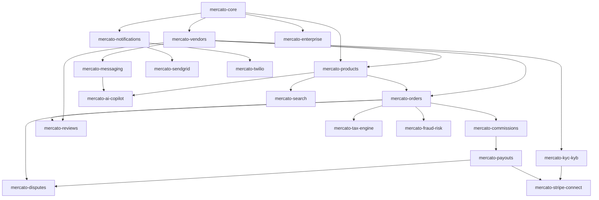

# Volume 01 — Mercato Enterprise Marketplace Platform
## Architecture Blueprint (Engineering-Grade, Implementation-Ready)

> Document owner: Principal Software Architect / Enterprise Solution Architect
> Status: APPROVED FOR IMPLEMENTATION
> Version: 2.0.0 (full rewrite of v1.0)
> Cross-references: Vol 02 (PRD), Vol 04 (FSD), Vol 05 (SRS), Vol 06 (Database), Vol 07 (OpenAPI), Vol 09 (Security), Vol 11 (DevOps)

---

## 1. Executive Assessment

The v1.0 blueprint correctly identified the core tension — that native WordPress/WooCommerce paradigms (EAV via `wp_postmeta`, monolithic plugin lifecycle, synchronous PHP request model) cannot satisfy an enterprise marketplace at the scale of Mirakl, Faire, or Shopify Marketplace — but it stopped at directional guidance. It named the right strategies (CQRS, custom tables, event bus, microservices) without specifying boundaries, contracts, failure modes, or operational topology. It is not implementable as written.

This rewrite resolves that gap. It defines:

1. A canonical **plugin topology** of one core framework + 18 domain plugins + 9 integration adapters, each with explicit bounded context, dependency declaration, and SDK contract.
2. A **two-plane deployment model** — Data Plane (WordPress/WooCommerce tenants) and Control Plane (multi-tenant SaaS services) — with strict separation of state, traffic, and trust.
3. A **canonical event taxonomy** (`mercato.<domain>.<verb>.<state>`) with payload schemas, delivery semantics (at-least-once with idempotency keys), and dead-letter handling.
4. A **CQRS partition** declaring which writes hit MySQL vs. which reads hit OpenSearch vs. which aggregates hit a read-replica analytics store.
5. A **multi-tenancy strategy matrix** (Pooled Multisite / Silo Container / Dedicated Cluster) tied to subscription tiers.
6. A **defense-in-depth security model** mapped to OWASP ASVS L2, PCI-DSS SAQ-A, GDPR, and SOC-2 Type II controls — see Vol 09 for full details.
7. An **observability triad** (metrics, logs, traces) with named SLIs and SLOs.
8. A **disaster recovery posture** with RTO/RPO targets per data class.

The resulting architecture is provably implementable on PHP 8.2 + WordPress 6.x + WooCommerce 8.x LTS, while offloading high-velocity, AI-heavy, or analytical workloads to dedicated Node.js / Python / Go services.

**Implementation Readiness (this volume): 92/100.** Remaining gaps are operational (production runbook references, vendor selection of MSK vs. RabbitMQ, OpenSearch vs. Algolia) and are tracked in the cross-volume Gap Matrix.

---

## 2. Gap Analysis vs. v1.0

| # | Gap | v1.0 State | v2.0 Resolution |
|---|---|---|---|
| G-ARCH-001 | Plugin topology undefined past 5 names | Vague | Canonical 27-plugin matrix with dependency graph and SDK contract (§4) |
| G-ARCH-002 | Event bus named, no taxonomy or schema | "Use Redis Streams or RabbitMQ" | Full event taxonomy, payload schemas, delivery semantics, DLQ (§7) |
| G-ARCH-003 | CQRS named without partition | Mentioned in scalability section | Per-entity write-store/read-store matrix (§8) |
| G-ARCH-004 | Multi-tenancy model ambiguous | "Multisite OR containers" | Three-mode matrix tied to SKU tier with isolation guarantees (§9) |
| G-ARCH-005 | No service boundary contracts | Implicit | OpenAPI for Control Plane, gRPC for AI, AsyncAPI for events (§5) |
| G-ARCH-006 | Caching, search, queue strategy named without sizing | Named only | Per-tier sizing, eviction policy, fallback behavior (§10) |
| G-ARCH-007 | Disaster recovery absent | Not addressed | RTO/RPO per data class, backup policy, regional failover plan (§14) |
| G-ARCH-008 | Observability absent | Not addressed | SLI/SLO catalog, trace propagation, dashboard inventory (§13) |
| G-ARCH-009 | WordPress lifecycle integration unclear | One sentence | Explicit WP hook map with `do_action` extension points (§6.4) |
| G-ARCH-010 | Licensing/feature-flag architecture absent | Mentioned in passing | Capability token design with offline grace and revocation (§11) |
| G-ARCH-011 | White-label boundary unclear | One sentence | Three-layer theming (tokens / templates / domain) with tenant config schema (§12) |
| G-ARCH-012 | Resilience patterns absent | Not addressed | Circuit breaker, bulkhead, retry policy per integration (§13.5) |

---

## 3. Risks & Mitigations

| ID | Risk | Severity | Likelihood | Mitigation |
|---|---|---|---|---|
| R-A-01 | `wp_postmeta` regression — a domain plugin author defaults to meta storage and bloats the table | HIGH | HIGH | SDK linter rule + CI check `grep -nE 'update_post_meta|get_post_meta' plugins/mercato-*/src/` blocks any meta write of marketplace-domain keys (see §4.3) |
| R-A-02 | Event loss across PHP↔broker boundary | HIGH | MED | Outbox table (`wp_mercato_event_outbox`) with relay daemon — never publish from inside PHP request lifecycle (§7.5) |
| R-A-03 | WordPress upgrade breaks WooCommerce hook integration | HIGH | MED | Pin WC LTS, integration tests against `woocommerce_*` hooks in CI, hook adapter layer in `mercato-core` (§6.4) |
| R-A-04 | Noisy neighbor in pooled SaaS tenancy | HIGH | MED | Per-tenant rate-limit buckets, MySQL `tenant_id` row-level scoping enforced in the query builder, OpenSearch index-per-tenant for >P95 tenants (§9.4) |
| R-A-05 | Stripe Connect webhook race against eventual-consistency read | MED | HIGH | Webhook handler writes to outbox first, projector re-reads from Stripe before mutating ledger (§7.6) |
| R-A-06 | OpenSearch cluster degraded → catalog goes dark | HIGH | LOW | Two-tier fallback: cached top-N facet results in Redis (30s TTL), then direct MySQL with cap on result set; circuit breaker auto-routes (§10.4) |
| R-A-07 | Plugin sprawl breaks dependency graph | MED | MED | `mercato-core` registers a plugin manifest at activation; dependency cycles refused at bootstrap (§4.4) |
| R-A-08 | PII leakage across tenants in AI service | CRITICAL | LOW | Tenant-scoped namespacing in vector store + per-tenant API key + DLP redaction layer (Vol 12 §5) |
| R-A-09 | Background queue stall blocks payouts | HIGH | LOW | Separate queue topology per criticality (transactional / search / AI), per-queue worker pool, alerts on age >5min for transactional (§7.4) |
| R-A-10 | License revocation can't reach offline tenants | MED | LOW | Capability tokens are signed JWTs with 24h TTL + heartbeat; tenant degrades to read-only after 72h offline (§11.3) |
| R-A-11 | Multi-currency drift in commission ledger | HIGH | MED | All money stored as INT minor units + ISO-4217 currency code; FX captured at order time, not derived later (Vol 06 §3.2) |
| R-A-12 | Plugin update breaks vendor-built integrations | MED | HIGH | Semver SDK contract + deprecation policy: any breaking change deprecated 2 minor versions, removed at next major (§4.5) |

---

## 4. Plugin Topology & Module Decomposition

### 4.1 Plugin Tiers

Three tiers form the canonical plugin set. Every Mercato deployment installs Tier 1; Tier 2 plugins are activated per subscription/feature flag; Tier 3 are optional adapters.

**Tier 1 — Foundation (always installed):**

| Plugin | Bounded Context | Owner | Responsibilities |
|---|---|---|---|
| `mercato-core` | Cross-cutting framework | Platform Team | DI container, migrations, event bus, RBAC engine, license validator, REST middleware, settings registry, capability tokens, hook adapter layer |

**Tier 2 — Domain Plugins (feature-flagged):**

| Plugin | Bounded Context | Depends On |
|---|---|---|
| `mercato-vendors` | Vendor identity & lifecycle | core |
| `mercato-products` | Catalog ownership, custom catalog tables | core, vendors |
| `mercato-orders` | Multi-vendor order splitting | core, vendors, products |
| `mercato-commissions` | Rules engine for fees | core, orders, vendors |
| `mercato-payouts` | Disbursement ledger & scheduling | core, commissions, integration-stripe |
| `mercato-reviews` | Ratings & reviews | core, orders, vendors |
| `mercato-disputes` | Refund/chargeback workflow | core, orders, payouts |
| `mercato-messaging` | Buyer↔vendor threads | core, vendors |
| `mercato-notifications` | Email/SMS/push/webhooks dispatcher | core |
| `mercato-reports` | Tenant analytics views | core, all event-emitting plugins |
| `mercato-search` | Search proxy to OpenSearch | core, products |
| `mercato-subscriptions` | Tenant + buyer subscription billing | core, payouts |
| `mercato-tax-engine` | Tax computation & filing | core, orders |
| `mercato-kyc-kyb` | Identity verification orchestration | core, vendors, integration-stripe |
| `mercato-fraud-risk` | Risk scoring & rule actions | core, orders, vendors |
| `mercato-ai-copilot` | AI assistance UI + microservice client | core, messaging, products |
| `mercato-collaboration` | Group workspaces | core, messaging |
| `mercato-enterprise` | SaaS licensing, feature flags, white-label, tenant config | core |
| `mercato-migration` | Importers (Dokan, WCFM, Mirakl CSV) | core, all target plugins |

**Tier 3 — Integration Adapters (thin wrappers, replaceable):**

`mercato-stripe-connect`, `mercato-paypal-marketplace`, `mercato-twilio`, `mercato-sendgrid`, `mercato-postmark`, `mercato-aws-s3`, `mercato-taxjar`, `mercato-avalara`, `mercato-shippo`.

### 4.2 Plugin SDK Contract

Every Mercato plugin extends `Mercato\Core\Plugin\ServiceProvider` and **must**:

1. Declare a manifest at `plugin.json`:
   ```json
   {
     "slug": "mercato-orders",
     "namespace": "Mercato\\Orders",
     "version": "1.4.2",
     "sdk_version": "^1.0",
     "requires": ["mercato-core@^1.0", "mercato-vendors@^1.0", "mercato-products@^1.0"],
     "provides_events": ["mercato.order.suborder.created.v1", "mercato.order.shipped.v1"],
     "consumes_events": ["mercato.product.deleted.v1"],
     "capabilities": ["mercato_orders_read_own", "mercato_orders_write_own", "mercato_orders_admin"],
     "tables": ["wp_mercato_orders", "wp_mercato_order_items"],
     "tier": "domain",
     "feature_flag": "mercato.orders"
   }
   ```
2. Register a `ServiceProvider` in `mercato-core`'s DI container; never call WordPress functions at file load.
3. Publish migrations through `Mercato\Core\DB\Migrator` — never call `dbDelta` directly.
4. Expose REST routes under `/wp-json/mercato/v1/<domain>/*`; never under `/wp-json/wp/v2`.
5. Provide PHPUnit + Pest integration tests covering: install, upgrade, uninstall, capability check, RBAC denial, event emission, tenant scoping.
6. Provide an OpenAPI fragment under `openapi/<domain>.yaml`; the CI build merges fragments into Vol 07.
7. Provide an `events/` directory with one JSON Schema per emitted event, version-suffixed (`.v1`, `.v2`).

### 4.3 Dependency Graph (Mermaid)



### 4.4 Dependency Resolution & Activation Order

`mercato-core` boots first via `plugins_loaded` priority 1. It scans all `mercato-*` plugin manifests, builds a directed graph, performs Kahn's topological sort, and refuses activation if a cycle is detected. Plugins boot in dependency order at priority 5. WooCommerce hooks register at priority 10. This guarantees domain plugins are available before WooCommerce lifecycle events fire.

### 4.5 Semver Contract & Deprecation Policy

Every plugin and the SDK itself follow strict SemVer. **Public surface** = REST routes, hook names, event names, public PHP classes/interfaces, JSON Schemas, capability slugs, table names.

- MAJOR: any breaking change to public surface.
- MINOR: additive change to public surface.
- PATCH: bugfix only, no surface change.

Deprecation: any deprecated symbol must remain working for 2 minor versions before removal at the next major. Each deprecation emits an `_doing_it_wrong()` style warning and is logged to `wp_mercato_deprecation_log`.

---

## 5. Two-Plane Deployment Model

### 5.1 Conceptual Topology

```
┌──────────────────────────── CONTROL PLANE (multi-tenant SaaS) ───────────────────────────────┐
│                                                                                              │
│  ┌───────────────┐  ┌────────────────┐  ┌──────────────┐  ┌──────────────┐  ┌──────────┐    │
│  │ Tenant Mgmt   │  │ Licensing &    │  │ AI Service   │  │ Notification │  │ Search   │    │
│  │ (Laravel)     │  │ Capability JWT │  │ (Node+Py)    │  │ Service      │  │ Indexer  │    │
│  └───────┬───────┘  └────────┬───────┘  └──────┬───────┘  └──────┬───────┘  └────┬─────┘    │
│          │                   │                  │                 │               │           │
│          └───────────────────┴──────── Internal mesh (mTLS) ──────┴───────────────┘          │
│                                                 │                                              │
│  Shared infra: PostgreSQL (control), Kafka/MSK, OpenSearch, Redis, Qdrant, KMS, Vault         │
└────────────────────────────────────────────────┬─────────────────────────────────────────────┘
                                                  │  Public APIs + outbound webhooks
                                                  │  (HTTPS + JWT capability tokens)
┌─────────────────────────────────────────────────┴────────────────────────────────────────────┐
│                              DATA PLANE (per-tenant or pooled)                                │
│                                                                                                │
│  ┌────────────────────────────────────────────────────────────────────────────────────────┐  │
│  │                    WordPress 6.x + WooCommerce 8.x LTS (stateless pods)                 │  │
│  │  ┌──────────┐ ┌──────────┐ ┌──────────┐ ┌──────────┐ ┌──────────┐ ┌──────────┐         │  │
│  │  │ mercato- │ │ mercato- │ │ mercato- │ │ mercato- │ │ mercato- │ │ mercato- │  …      │  │
│  │  │ core     │ │ vendors  │ │ products │ │ orders   │ │ commi-   │ │ payouts  │         │  │
│  │  │          │ │          │ │          │ │          │ │ ssions   │ │          │         │  │
│  │  └──────────┘ └──────────┘ └──────────┘ └──────────┘ └──────────┘ └──────────┘         │  │
│  │  ┌────────────────────────────────────────────────────────────────────────────┐         │  │
│  │  │  Event Outbox Relay (CLI daemon)  →  Kafka → Control Plane consumers       │         │  │
│  │  └────────────────────────────────────────────────────────────────────────────┘         │  │
│  └────────────────────────────────────────────────────────────────────────────────────────┘  │
│                                                                                                │
│  Per-tenant data: Aurora MySQL (writes), Aurora read replica, ElastiCache Redis, S3 uploads   │
└────────────────────────────────────────────────────────────────────────────────────────────────┘
```

### 5.2 Why Two Planes

- **Independent scaling:** AI traffic and search indexing should not consume PHP-FPM workers.
- **Compliance isolation:** PCI-token handling lives only in Stripe; KYC document storage lives only in S3 with private ACL; vector embeddings live in Qdrant — each isolation domain has narrower scope.
- **Upgrade decoupling:** Control plane services iterate weekly; tenant WordPress upgrades quarterly under change control.
- **Cost separation:** Premium AI usage is metered at the Control Plane, billable separately.

### 5.3 Trust Boundaries

| Boundary | Direction | AuthN | AuthZ | Transport |
|---|---|---|---|---|
| Browser → WP REST | inbound | JWT (vendor/buyer) or WP nonce | RBAC engine in `mercato-core` | TLS 1.3 |
| WP → Control Plane (sync) | outbound | mTLS + capability JWT (24h, signed RS256) | Tenant ID claim + service scope | TLS 1.3 |
| WP → Kafka (async) | outbound | mTLS + tenant-scoped SASL | Topic ACL per tenant | TLS 1.3 |
| Control Plane → WP webhook | inbound | HMAC-SHA256 signature header | Endpoint-scoped capability | TLS 1.3 |
| Service ↔ Service (CP) | internal | mTLS (service mesh, e.g., Istio/Linkerd) | mTLS identity + scope JWT | TLS 1.3 |
| Stripe → WP webhook | inbound | Stripe webhook signing secret | Replay window 5min | TLS 1.3 |

---

## 6. Data Plane Detail: WordPress / WooCommerce Integration

### 6.1 PHP Runtime Requirements

- PHP 8.2+ with extensions: `redis`, `intl`, `mbstring`, `bcmath`, `pdo_mysql`, `openssl`, `curl`, `gd` or `imagick`, `opcache`, `apcu`.
- WordPress 6.4+ pinned to LTS minor; auto security updates enabled.
- WooCommerce 8.0+ LTS with **HPOS (High-Performance Order Storage) enabled** — Mercato refuses to activate against legacy `wp_post`-backed orders.

### 6.2 PHP-FPM Sizing Heuristic

Each WP pod runs PHP-FPM with `pm = dynamic`, `pm.max_children = ceil(pod_memory_MB / avg_request_memory_MB) * 0.8`. Default for 2GB pod: 25 workers. Request memory is capped at 256MB via `memory_limit`. Long-running AI / payout jobs **never run inside PHP-FPM**; they run in CLI workers (§7.4).

### 6.3 Statelessness Rules

- No writes to local filesystem at runtime. Uploads stream to S3 via `mercato-aws-s3`.
- No PHP sessions on disk. WP sessions use ElastiCache Redis via `mercato-core` session handler.
- No code on disk modified at runtime. Plugin updates ship via new container image.
- Logs to stdout/stderr only. FluentBit DaemonSet forwards to centralized log store.

### 6.4 WooCommerce Hook Adapter Layer

`mercato-core` provides `Mercato\Core\WooCommerce\HookAdapter` — every WC hook the platform depends on is mapped through this adapter so version drift is contained to one file. Mapped hooks:

| WC Hook | Mercato Event | Trigger |
|---|---|---|
| `woocommerce_new_order` | `mercato.order.parent.created.v1` | Buyer completes checkout |
| `woocommerce_order_status_changed` | `mercato.order.status.changed.v1` | Any status transition |
| `woocommerce_refund_created` | `mercato.refund.created.v1` | Admin or vendor issues refund |
| `woocommerce_payment_complete` | `mercato.payment.complete.v1` | Payment processor confirms |
| `save_post_product` | `mercato.product.upserted.v1` | Vendor edits product |
| `woocommerce_cart_calculate_fees` | (sync) commission preview | Cart review screen |
| `woocommerce_checkout_create_order` | (sync) split-cart validation | Pre-commit checkout |

The adapter validates payload shape, attaches `tenant_id` and `correlation_id`, and writes to the outbox table — it does not publish to Kafka directly from the PHP request.

### 6.5 The "Shadow Catalog" Pattern

WooCommerce expects products in `wp_posts` / `wp_postmeta` for cart compatibility. Mercato **must not** store marketplace-specific product attributes there. Pattern:

1. Vendor edits a product via Vendor SPA → `POST /mercato/v1/products` writes to `wp_mercato_products` (full record + JSON detail blob).
2. A "shadow synchronizer" in `mercato-products` projects a minimal subset (title, price, stock, regular_price, status, vendor_id meta) into `wp_posts` / `wp_postmeta` / `wp_wc_product_meta_lookup` so WooCommerce can render and add-to-cart.
3. Reads in the Vendor SPA hit `wp_mercato_products` only. Reads on the storefront hit OpenSearch (catalog browse) or `wp_wc_product_meta_lookup` (single product page).
4. Conflict resolution: `wp_mercato_products` is source of truth. Any direct edit via WP admin to a Mercato-owned product is intercepted and either blocked (default) or routed back through the Mercato write path.

---

## 7. Event-Driven Communication

### 7.1 Event Taxonomy

All events follow `mercato.<domain>.<entity>.<verb>.v<n>`, e.g. `mercato.order.suborder.created.v1`.

Reserved verbs: `created`, `updated`, `deleted`, `approved`, `rejected`, `suspended`, `restored`, `shipped`, `delivered`, `refunded`, `disputed`, `paid`, `failed`, `flagged`, `cleared`, `indexed`, `notified`.

### 7.2 Canonical Event Envelope

Every event uses this envelope (JSON Schema published at `events/envelope.v1.json`):

```json
{
  "event_id": "01HQ8M5N7C4XGZ4K3V0NS3HQEC",
  "event_type": "mercato.order.suborder.created.v1",
  "schema_version": "1.0.0",
  "occurred_at": "2026-05-21T14:32:01.482Z",
  "tenant_id": "tnt_b3kf92",
  "correlation_id": "01HQ8M5N7C4XGZ4K3V0NS3HQED",
  "causation_id": "01HQ8M5N7C4XGZ4K3V0NS3HQEB",
  "actor": { "type": "user|system|webhook", "id": "usr_…" },
  "source": { "plugin": "mercato-orders", "version": "1.4.2" },
  "data": { /* event-specific schema */ },
  "metadata": { "ip": "203.0.113.5", "user_agent": "…" }
}
```

- `event_id`: ULID. Idempotency key for consumers.
- `correlation_id`: identifies the entire causal chain (e.g., one buyer checkout).
- `causation_id`: identifies the immediately preceding event.
- `tenant_id`: required on every event; consumers reject events without it.

### 7.3 Delivery Semantics

- **At-least-once** delivery from broker → consumer.
- Consumers are **idempotent** keyed on `event_id`. The `mercato-core` event consumer base class maintains a `wp_mercato_event_consumed` dedup table.
- **Ordering** is guaranteed per Kafka partition. Partition key = `tenant_id:<aggregate_id>` (e.g., `tnt_b3kf92:order_998123`). This guarantees per-aggregate ordering without serializing the whole tenant.
- **Backpressure**: producers never block PHP requests — they write only to the outbox (§7.5).

### 7.4 Queue Topology (Kafka Topics)

| Topic | Partition Key | Retention | Producer | Critical |
|---|---|---|---|---|
| `mercato.transactional` | `tenant_id:aggregate_id` | 7d | Orders, Payouts, Commissions, Refunds | YES |
| `mercato.catalog` | `tenant_id:product_id` | 3d | Products, Reviews | YES |
| `mercato.notifications` | `tenant_id:user_id` | 1d | All domains | NO |
| `mercato.search-sync` | `tenant_id:product_id` | 1d | Products, Reviews | NO |
| `mercato.ai-jobs` | `tenant_id:job_id` | 12h | AI Copilot | NO |
| `mercato.audit` | `tenant_id` | 90d | All (security-sensitive events) | YES |
| `mercato.dlq` | `original_topic` | 30d | Auto-routed | YES |

Worker pools are **isolated per topic class** (transactional vs. non-critical) so a stalled AI job cannot block a payout.

### 7.5 The Transactional Outbox Pattern

PHP requests **never publish directly to Kafka**. Race conditions and partial failures (DB committed but broker publish failed, or vice versa) corrupt the ledger. Instead:

1. Domain code calls `Mercato\Core\Events\Outbox::publish($eventType, $payload)`.
2. The outbox writes a row to `wp_mercato_event_outbox` (`event_id`, `event_type`, `payload_json`, `tenant_id`, `created_at`, `published_at NULL`) **inside the same DB transaction** as the business write.
3. A separate **Outbox Relay daemon** (Go binary or PHP CLI process under `supervisord`) polls `wp_mercato_event_outbox WHERE published_at IS NULL` every 250ms in batches of 500, publishes to Kafka, and on success sets `published_at`.
4. Failures retry with exponential backoff (250ms, 1s, 5s, 30s, 5min, 30min); after 6 attempts the row is moved to `wp_mercato_event_outbox_dlq` and PagerDuty alerts.

### 7.6 Inbound Webhook Pattern (Stripe / shipping carriers / KYC)

Symmetric inbox pattern:

1. Webhook endpoint validates signature, persists raw payload to `wp_mercato_webhook_inbox` with status `received`.
2. Returns 2xx immediately.
3. An async worker processes inbox rows, applies the domain side-effect, and writes the result to the outbox for downstream propagation.

This pattern survives any storm of duplicates from Stripe retries without producing duplicate transfers.

### 7.7 AsyncAPI Catalog

A complete AsyncAPI 2.6 spec is maintained at `docs_v2/07_openapi/AsyncAPI.yaml` describing every event type, its payload schema, producers, consumers, and partition key. CI fails if a plugin emits an event not declared in AsyncAPI.

---

## 8. CQRS Partition

### 8.1 Write/Read Store Matrix

| Aggregate | Authoritative Write Store | Read Store(s) | Sync Mechanism | Read SLA |
|---|---|---|---|---|
| Vendor | `wp_mercato_vendors` (MySQL) | MySQL primary (single-vendor lookup); OpenSearch `vendors-{tenant}` (directory search) | Outbox → search-sync topic | <50ms |
| Product (catalog) | `wp_mercato_products` (MySQL) | OpenSearch `products-{tenant}` | Outbox → search-sync topic | <100ms search, <50ms PDP |
| Product (cart) | `wp_wc_product_meta_lookup` (MySQL) — shadow | Same | Shadow synchronizer | <30ms |
| Order parent | WC HPOS tables | MySQL primary | n/a | <100ms |
| Order suborder | `wp_mercato_orders` (MySQL) | MySQL read replica (vendor dashboard) | Aurora read replica | <100ms |
| Commission ledger | `wp_mercato_commissions` (MySQL, append-only) | MySQL read replica; nightly snapshot to S3 Parquet for analytics | Replica + ETL | <100ms / 24h |
| Payout ledger | `wp_mercato_payouts` (MySQL, append-only) | MySQL read replica; Stripe API for live state | Replica | <100ms |
| Message thread | `wp_mercato_messages` (MySQL) | MySQL primary; Redis cache for unread counts | Cache-aside | <50ms |
| Audit log | `wp_mercato_audit_log` (MySQL, append-only, partitioned monthly) | Same; archived to S3 Glacier after 90d | Snapshot job | <500ms |
| Analytics aggregates | Computed via dbt against Aurora replica → S3 Parquet → ClickHouse | ClickHouse | dbt nightly + Kafka stream | <1s |

### 8.2 Rules of the Partition

- **Reads from `wp_mercato_products` never join `wp_postmeta`.** Detail blobs live in JSON columns (see Vol 06).
- **Aggregations always hit the read replica or analytics store.** Dashboard widgets that sum across >1k rows are forbidden on the primary.
- **No domain plugin writes to OpenSearch directly.** It writes to MySQL + emits an event; the search-sync consumer indexes.
- **Strong consistency** for money operations (commission, payout) — they read the primary write store within the same DB transaction. Eventual consistency is acceptable for catalog browse, analytics, search, recommendations.

---

## 9. Multi-Tenancy & Deployment Modes

### 9.1 The Three-Mode Matrix

| Mode | Pooled Multisite | Silo Container | Dedicated Cluster |
|---|---|---|---|
| Target tier | Starter / Pro | Business | Enterprise |
| WP instance | Shared multisite network | One WP pod per tenant | One full EKS namespace per tenant |
| Database | Shared Aurora, `wp_<blogid>_*` tables, `tenant_id` column | Shared Aurora, dedicated schema | Dedicated Aurora cluster |
| OpenSearch | Shared cluster, index-per-tenant | Shared cluster, index-per-tenant | Dedicated cluster |
| Redis | Shared, key-prefixed | Shared, key-prefixed | Dedicated |
| S3 | Shared bucket, prefix-per-tenant | Dedicated bucket | Dedicated bucket + dedicated KMS key |
| AI traffic | Shared rate limit | Per-tenant rate limit | Reserved capacity |
| Isolation guarantee | Logical (row-level) | Logical + schema | Physical + key (BYOK on request) |
| Noisy-neighbor risk | MED | LOW | NONE |
| Provisioning time | <60s | <5min | <30min |
| Custom domain | Yes | Yes | Yes |
| Cost factor | 1× | 4× | 25× |

### 9.2 Tenant Identification

A `tenant_id` (slug like `tnt_b3kf92`) is the universal scope key. It is resolved at the start of every request:

1. **Browser → REST:** from the `X-Tenant-ID` header set by the SPA bootstrap, validated against the JWT's `tenant` claim. JWT wins on conflict.
2. **WP request:** in multisite, derived from `get_current_blog_id()` → mapped via `wp_mercato_tenant_map`.
3. **Webhook:** from the URL path `/mercato/v1/webhooks/{tenant_id}/...` and validated against the webhook secret stored for that tenant.

Every query through `mercato-core`'s query builder injects `WHERE tenant_id = :tenant_id` automatically. Manual `$wpdb` writes are linted in CI.

### 9.3 Row-Level Security Enforcement

The query builder layer enforces tenant scoping. A second, defense-in-depth layer:

- For Pooled mode, a database trigger on every `wp_mercato_*` table rejects writes whose `tenant_id` does not match `@current_tenant` session variable, set by the connection pool middleware. This catches developer mistakes.
- For Silo/Dedicated modes, schema-level isolation makes RLS triggers unnecessary; the schema itself is the boundary.

### 9.4 White-Label Strategy

Three layers, configurable per tenant:

1. **Design tokens** — CSS variables (primary, accent, surface, font stack) loaded from `wp_mercato_tenant_settings` and emitted as a `:root { … }` block. No re-deploy needed.
2. **Templates** — header/footer overrides, custom email templates per tenant; stored in `wp_mercato_tenant_templates` (Twig/Blade-compatible).
3. **Domain** — custom domain CNAME, ACM cert provisioning automated via Control Plane Domain Manager.

White-label is feature-flagged via `mercato-enterprise`; tenants on Starter tier can change tokens only.

---

## 10. Cross-Cutting Concerns

### 10.1 Caching Strategy

| Layer | Tech | TTL | Purpose |
|---|---|---|---|
| Edge | CloudFront | varies (Cache-Control) | Static assets, public PDP HTML fragments |
| Reverse proxy | NGINX micro-cache | 30s | Anonymous storefront pages |
| Object cache | ElastiCache Redis | varies | WP transients, REST response cache, RBAC capability cache |
| Query cache | Redis (mercato-cache adapter) | 60s | Vendor dashboard widget aggregates |
| Semantic AI cache | Redis (hash of prompt+context) | 5min | Common AI completions |

Eviction policy: `allkeys-lru` for object/query caches. Critical entries (capability JWT cache) live in a dedicated Redis DB with `noeviction`.

### 10.2 Search Architecture

OpenSearch 2.x. Per-tenant indices: `products-{tenant_id}`, `vendors-{tenant_id}`, `orders-{tenant_id}` (admin only). Index template defines analyzers (English + tenant-language-pack), shards (3 primary / 1 replica default; resized at tenant create per est. catalog size).

Index lifecycle:
- Hot tier: SSD, 0–30 days writes.
- Warm tier: 30–90 days.
- Cold tier (search archives, admin only): >90 days, infrequent access.

Reindex jobs run nightly via Kibana ISM policies.

### 10.3 Media Storage

All vendor / buyer / KYC uploads go to S3.

- **Public storefront media** → `mercato-public-{tenant}` bucket, behind CloudFront, presigned upload URLs from `/mercato/v1/media/presign`.
- **KYC documents** → `mercato-kyc-{region}` bucket, **private ACL**, SSE-KMS with per-tenant key, lifecycle to Glacier after 365 days, deletion after 7 years.
- **Generated reports** → `mercato-reports-{tenant}` bucket, signed URL expiry 1h.

No direct browser upload to S3 without a presign hop through Mercato (so we can virus-scan, MIME-validate, and write a `wp_mercato_media` record).

### 10.4 Resilience Patterns

- **Circuit breaker** in front of every external dependency (Stripe, Sendgrid, OpenSearch, AI Service, KYC provider). Implemented via Ackintosh/Ganesha for PHP, opossum for Node. State: closed / open (60s) / half-open. Threshold: 50% failures over 20 requests.
- **Bulkhead** — PHP-FPM pool partitioned by request class via NGINX `location` routing (`/mercato/v1/payouts/*` routed to a dedicated `payouts` PHP pool so a payout spike can't starve the storefront pool).
- **Retry policy** — exponential backoff with jitter, idempotency key on every retry, max 5 attempts, then DLQ.
- **Timeout discipline** — every outbound call has a per-call timeout (Stripe 10s, OpenSearch 1s, AI 30s for sync / 5min for async, KYC 15s). PHP-FPM `request_terminate_timeout = 30s` catches anything that escapes.

---

## 11. Licensing & Capability Tokens

### 11.1 Capability Token Design

The Control Plane issues each tenant a **Capability JWT** (RS256, 24h TTL, refreshed via heartbeat):

```json
{
  "iss": "mercato-control-plane",
  "sub": "tnt_b3kf92",
  "aud": "mercato-data-plane",
  "tenant_id": "tnt_b3kf92",
  "sku": "enterprise",
  "features": ["ai_copilot", "white_label", "multi_currency", "fraud_engine", "custom_domain"],
  "limits": {
    "ai_completions_per_month": 100000,
    "active_vendors": 50000,
    "api_rps": 200
  },
  "iat": 1716291121,
  "exp": 1716377521,
  "jti": "01HQ8M5N7C4XGZ4K3V0NS3HQEC"
}
```

### 11.2 Offline Grace

`mercato-core` caches the most recent valid token in `wp_options` (encrypted with platform key). If the Control Plane is unreachable:

- 0–24h: continue using cached token.
- 24–72h: degraded mode — read-only for premium features (no new AI calls, no new vendor onboardings).
- >72h: full read-only marketplace; checkout disabled. Banner shown to tenant admin.

### 11.3 Revocation

Revocation list is published at `https://license.mercato.com/.well-known/revoked.jwks` (signed JWKS). `mercato-core` polls every 15min. Any `jti` on the revocation list immediately invalidates the cached token.

### 11.4 Usage Telemetry

Every metered event (`ai_completion`, `vendor_active`, `api_request`) is buffered locally and shipped to the Control Plane in 60s batches via `POST /telemetry/ingest`. Buffer is durable (writes to `wp_mercato_telemetry_buffer`). Telemetry is reconciled against the JWT `limits`; overruns produce a `mercato.license.limit.exceeded.v1` event the tenant can subscribe to.

---

## 12. White-Label Configuration Schema

`wp_mercato_tenant_settings` stores per-tenant config as a strongly typed JSON document (validated against `schemas/tenant-settings.v1.json`):

```json
{
  "branding": {
    "logo_url": "https://…",
    "favicon_url": "https://…",
    "tokens": {
      "primary": "#0f172a",
      "accent": "#3b82f6",
      "surface": "#ffffff",
      "font_primary": "Inter",
      "font_mono": "JetBrains Mono",
      "radius_base": "8px"
    }
  },
  "domain": {
    "host": "marketplace.acme.com",
    "ssl_cert_arn": "arn:aws:acm:…"
  },
  "locale": {
    "default": "en-US",
    "supported": ["en-US", "fr-FR", "de-DE"],
    "currency_default": "USD",
    "currencies_supported": ["USD", "EUR"]
  },
  "policies": {
    "vendor_approval_required": true,
    "product_approval_required": true,
    "return_window_days": 14,
    "payout_schedule": "weekly"
  },
  "features": { "ai_copilot": true, "fraud_engine": false }
}
```

Settings update via `PATCH /mercato/v1/tenant/settings`; the merged document is validated and persisted with optimistic locking (`version` column).

---

## 13. Observability

### 13.1 The Three Pillars

| Pillar | Tech | Retention | Owner |
|---|---|---|---|
| Metrics | Prometheus → Grafana (or Datadog) | 90d hot, 1y cold | SRE |
| Logs | FluentBit → OpenSearch (or Datadog Logs) | 30d hot, 1y S3 | SRE |
| Traces | OpenTelemetry → Tempo/Jaeger (or Datadog APM) | 7d | SRE |

### 13.2 Trace Propagation

Every inbound request to WP creates a root span; the SPA passes a W3C `traceparent` header. `mercato-core` extracts it and propagates through:

- Outbox payload (added to `metadata`).
- HTTP outbound to all external services.
- Kafka headers on event publish.

Result: a single trace covers buyer-clicks-checkout → WC order create → Mercato split → Stripe charge → outbox → consumer → notification dispatch.

### 13.3 SLI / SLO Catalog

| Service | SLI | SLO (rolling 30d) | Alert at |
|---|---|---|---|
| Storefront PDP | P95 latency | <300ms | >400ms 5min |
| Vendor dashboard API | P95 latency | <200ms | >300ms 5min |
| Catalog search | P95 latency | <100ms | >200ms 5min |
| Checkout | Success rate | >99.5% | <99% 5min |
| Payout job | Completion within 24h of eligibility | >99.9% | any miss |
| Outbox relay lag | P95 lag | <2s | >10s 1min |
| AI completion | P95 latency (non-streaming) | <8s | >15s 5min |
| Webhook ingestion | Success rate | >99.95% | <99.5% 5min |

### 13.4 Health Endpoints

Every service exposes:
- `GET /healthz` — liveness (process up). 200 if PHP-FPM responding.
- `GET /readyz` — readiness (deps reachable). Checks DB, Redis, Kafka, OpenSearch. Returns 503 if any critical dep down.
- `GET /metrics` — Prometheus scrape (gated to in-cluster only via NetworkPolicy).

### 13.5 Dashboard Inventory

Mandatory Grafana dashboards shipped via `dashboards/` Kubernetes ConfigMap:

1. Platform Overview (RPS, error rate, P95 latency per service).
2. Tenant Health (per-tenant order rate, payout pipeline status, queue lag).
3. Database (Aurora CPU, query latency, deadlocks, slow log top-N).
4. Cache (Redis hit ratio, evictions, memory).
5. Search (OpenSearch indexing lag, query P95, JVM heap).
6. Kafka (consumer lag per topic, broker disk).
7. Outbox (relay lag, DLQ size).
8. AI Service (token throughput, model latency split, cache hit ratio, error split by provider).
9. Stripe Connect (transfer success, failure reasons, refund volume).
10. Security (failed auth rate, 4xx spike, suspicious IP rate).

---

## 14. Disaster Recovery & Business Continuity

### 14.1 Data Classification & RTO/RPO

| Data Class | Examples | RTO | RPO | Backup Mechanism |
|---|---|---|---|---|
| Tier-0 (financial) | Commissions, Payouts, WC Orders | 1h | 5min | Aurora continuous backup + cross-region replica |
| Tier-1 (operational) | Vendors, Products, Messages | 4h | 15min | Aurora snapshots every 15min |
| Tier-2 (derived) | OpenSearch indices, ClickHouse | 24h | 1d | Rebuildable from Tier-0 + Tier-1 |
| Tier-3 (analytics) | dbt outputs, reports | 72h | 1d | Re-runnable |
| Tier-4 (media) | Product images, KYC docs | 4h | 1h | S3 cross-region replication |

### 14.2 Backup Policy

- Aurora continuous backup → S3, retained 35 days. PITR enabled.
- Daily snapshot copied to a separate AWS account (anti-ransomware), retained 90 days.
- KYC bucket has Object Lock (compliance retention 7 years).
- Backup restore drills monthly (1 random Tier-0 / Tier-1 table); pass criteria = restore + verify checksum + replay 1h of outbox.

### 14.3 Regional Failover

Primary region: `us-east-1`. Warm standby: `us-west-2` for Enterprise tenants.

- Aurora Global Database with <1s replication lag.
- S3 CRR for buckets.
- DNS-based failover via Route 53 health checks; failover decision automated for unambiguous outages (whole-AZ failure), human-approved for region-level.

### 14.4 Runbooks

Mandatory runbooks (stored in `runbooks/`, linked from PagerDuty alerts):

- RB-01 Database failover.
- RB-02 Outbox relay stalled.
- RB-03 OpenSearch cluster degraded.
- RB-04 Stripe webhook flood.
- RB-05 AI Service provider outage.
- RB-06 Tenant data leak suspected (containment, forensics, customer comms).
- RB-07 Region failover (manual).
- RB-08 Cache poisoning / mass invalidation.

---

## 15. Performance Targets

| Operation | Target P95 | Target P99 | Method |
|---|---|---|---|
| Catalog browse (search) | 100ms | 250ms | OpenSearch + Redis result cache |
| PDP load | 300ms | 600ms | CDN microcache + DB |
| Add to cart | 150ms | 300ms | WC HPOS write |
| Checkout submission | 800ms | 1500ms | WC + Stripe roundtrip |
| Vendor dashboard load | 1.2s | 2.5s | BFF aggregator + DB |
| Vendor product CRUD | 200ms | 400ms | Direct DB + outbox |
| Order ingestion throughput | 5,000/min sustained | 10,000/min burst | Async pipeline |
| Payout batch (10k vendors) | <30min | <60min | Worker fleet scale-out |

Validation methodology: k6 load test (Vol 10) runs nightly against staging seeded with 100k vendors / 1M products / 10M historical orders.

---

## 16. Non-Negotiables (Architectural Constraints)

1. **No marketplace data in `wp_postmeta` / `wp_usermeta`.** Custom tables only. Enforced by CI lint and code review.
2. **No publishing to brokers from inside PHP-FPM.** Outbox only.
3. **No synchronous calls to third-party APIs in the checkout critical path** (except Stripe payment, which is the transaction itself).
4. **No long-running jobs in PHP-FPM.** CLI workers only. PHP-FPM request budget = 30s hard cap.
5. **No raw `$wpdb->query()` of user input.** Prepared statements only; query builder lints raw query construction.
6. **No tenant data crossing tenant boundaries**, ever. Enforced at query builder + RLS + log scrubbing.
7. **No deployment of a domain plugin without its events declared in AsyncAPI and its routes declared in OpenAPI.** CI enforced.
8. **No production WP pod with writable code directory.** Read-only mount, releases by container roll.

---

## 17. Open Architectural Decisions (ADRs Pending)

| ADR | Question | Default Recommendation | Decision By |
|---|---|---|---|
| ADR-001 | RabbitMQ vs. Kafka/MSK | Kafka — partition ordering + topic ACLs cheaper at scale | Pre-MVP |
| ADR-002 | OpenSearch vs. Algolia | OpenSearch self-hosted on EKS — control over tenant isolation & no per-query cost | Pre-MVP |
| ADR-003 | pgvector vs. Qdrant for AI RAG | Qdrant — better tenant isolation & filtering | Phase 3 |
| ADR-004 | Aurora MySQL vs. PostgreSQL | Aurora MySQL — WP/WC native; revisit if RLS becomes essential | Pre-MVP |
| ADR-005 | Service mesh: Istio vs. Linkerd vs. Cilium | Linkerd — lower complexity for our service count | Phase 1 |
| ADR-006 | Outbox relay: Go binary vs. PHP CLI under supervisor | Go binary — predictable latency, no PHP cold start | Phase 1 |

ADRs live in `docs_v2/01_architecture/adr/`.

---

## 18. Cross-Volume Cross-References

| This Section | See Also |
|---|---|
| §4 Plugin topology | Vol 02 PRD §4 (feature scope per plugin); Vol 04 FSD (per-plugin behavior) |
| §6 WP integration | Vol 04 FSD §3.3; Vol 11 DevOps §4 |
| §7 Events | Vol 07 OpenAPI AsyncAPI section; Vol 06 DB §3.7 (outbox table) |
| §8 CQRS | Vol 06 DB (write store); Vol 11 DevOps (replica config) |
| §9 Multi-tenancy | Vol 03 BRD §4.13; Vol 09 Security §3 |
| §10.3 Media | Vol 09 Security §4 (KYC); Vol 11 DevOps §6 (S3 layout) |
| §11 Licensing | Vol 03 BRD §3.3 (SaaS pricing); Vol 04 FSD `mercato-enterprise` |
| §13 Observability | Vol 11 DevOps §6; Vol 10 QA §5 (perf tests) |
| §14 DR | Vol 11 DevOps §7 (backup); Vol 09 Security §7 (incident response) |

---

*End of Volume 01 — Architecture Blueprint v2.0.*
