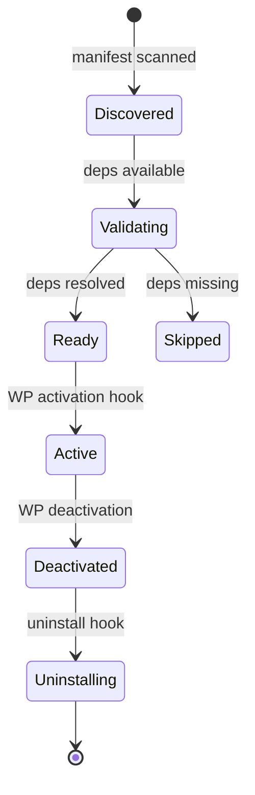
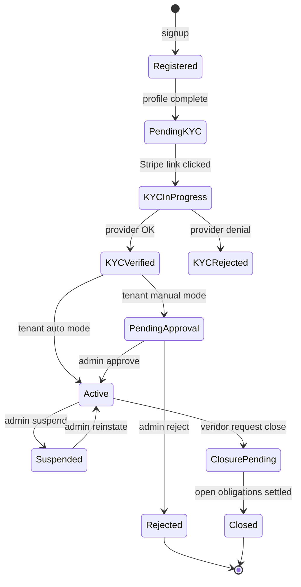
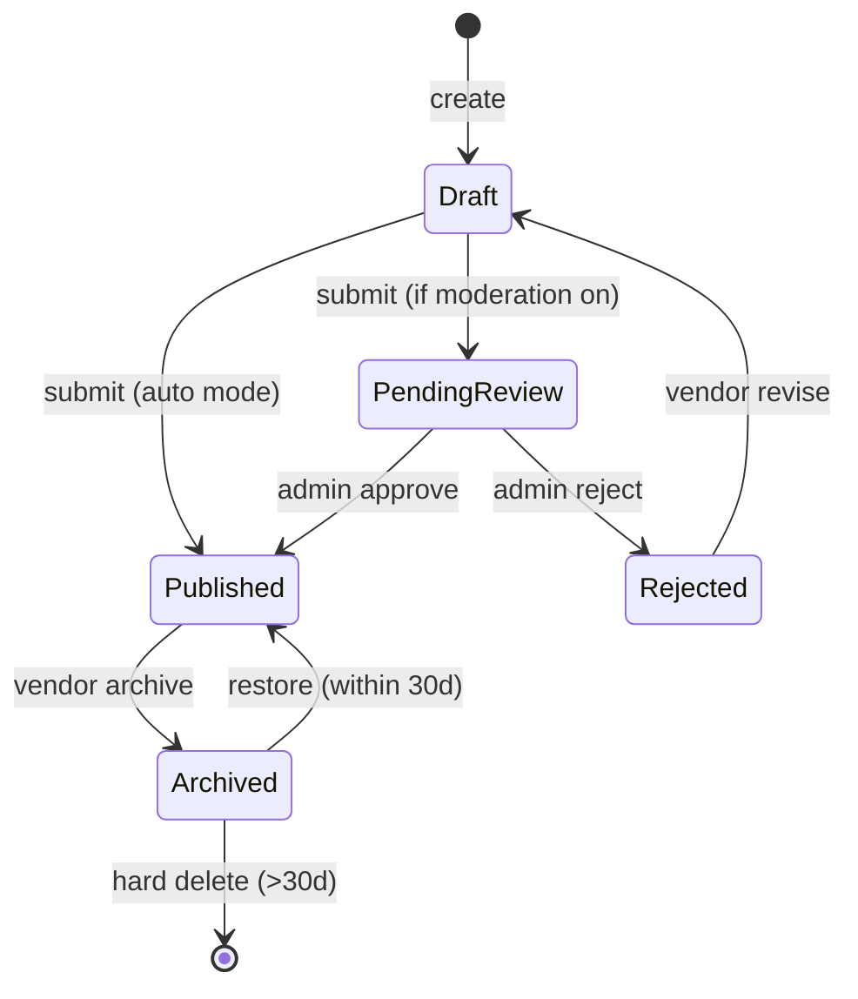
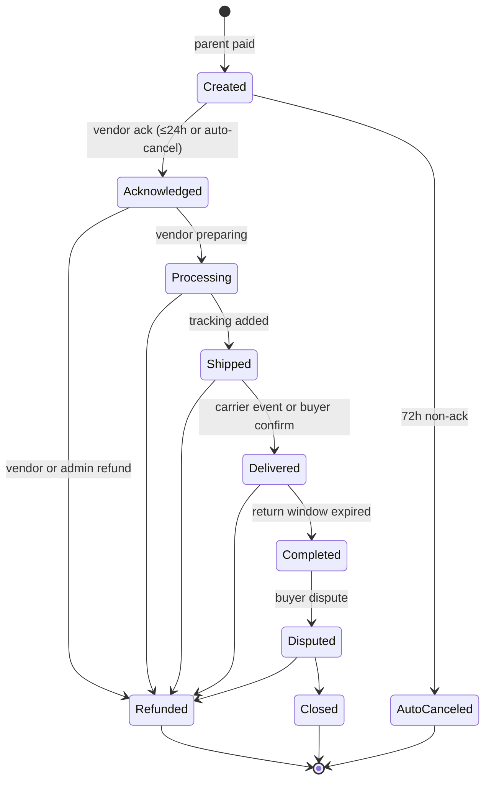
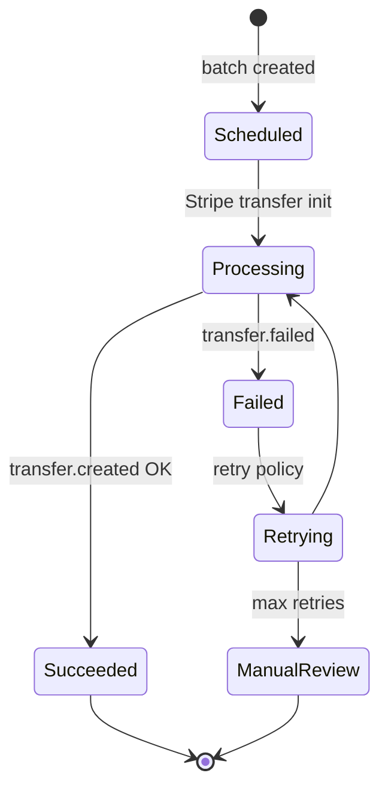
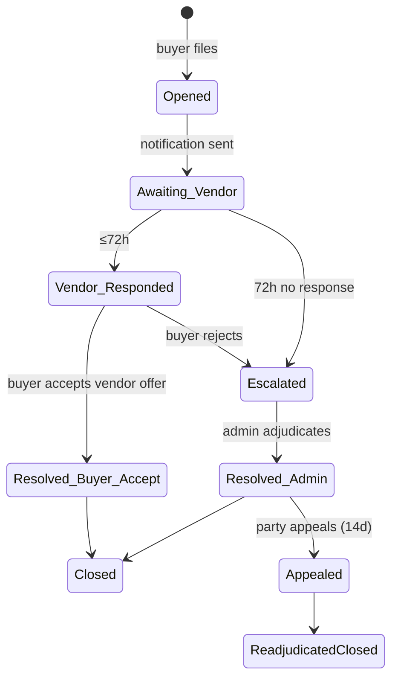

# Volume 04 — Mercato Enterprise Marketplace Platform
## Functional Specification Document (Engineering-Grade, Implementation-Ready)

> Document owner: Principal Software Architect + Senior PMs + Tech Leads per domain
> Status: Implementation Baseline v2.0 — Approved for MVP planning; ADRs pending
> Version: 2.0.0 (full rewrite of v1.0)
> Cross-references: Vol 01 (Architecture), Vol 02 (PRD), Vol 06 (Database), Vol 07 (OpenAPI), Vol 09 (Security)

---

## 1. Executive Assessment

The v1.0 FSD outlined the modular architecture and core workflows but treated each domain as a paragraph rather than a spec. Engineering cannot build from "intercepts WooCommerce order creation and generates sub-orders" — it needs the exact hook, the exact state machine, the exact failure paths, the exact persistence shape, the exact event emitted, and the exact RBAC capability check.

This rewrite delivers, for every domain plugin: (a) responsibilities & scope, (b) state machine where applicable, (c) functional requirements (FR-X-NNN) traceable to PRD stories and SRS REQs, (d) inputs & validations, (e) outputs (events emitted, REST surface), (f) RBAC & tenant scoping, (g) failure paths & error codes, (h) integration points with other plugins.

The FSD is partitioned by domain plugin matching Vol 01 §4. Each section is independently consumable by the domain owner.

**Implementation Readiness (this volume): 91/100.** Outstanding gaps: a few terminal state transitions in dispute escalation and the precise webhook retry policy for KYC providers, tracked in the Gap Matrix.

---

## 2. Gap Analysis vs. v1.0

| # | Gap | v1.0 | v2.0 |
|---|---|---|---|
| G-FSD-001 | No state machines | Prose | Explicit Mermaid state diagrams per aggregate (§4–§22) |
| G-FSD-002 | No FR identifiers | Unstructured | `FR-<plugin>-<n>` registry (~280 FRs) |
| G-FSD-003 | Failure paths missing | Happy path | "Failure & Edge Cases" subsection in every domain (§4–§22) |
| G-FSD-004 | Error code catalog absent | None | Canonical error code catalog (§3.5) |
| G-FSD-005 | Idempotency not specified | None | Per-mutation idempotency key contract (§3.4) |
| G-FSD-006 | Tenant scoping rules vague | Mentioned | Per-endpoint `tenant_id` enforcement table (§3.3) |
| G-FSD-007 | Hook adapter undefined | Mentioned | Full hook-to-event map (§3.6) |
| G-FSD-008 | No transactional boundaries | Not specified | DB transaction + outbox boundary per write (§3.7) |

---

## 3. Cross-Cutting Functional Conventions

### 3.1 Naming
- REST routes: `/wp-json/mercato/v1/<resource>` — kebab-case nouns; verbs through HTTP method.
- Events: `mercato.<plugin>.<entity>.<verb>.v<n>`.
- Database tables: `wp_mercato_<plural_noun>`.
- Capabilities: `mercato_<resource>_<action>` (e.g., `mercato_orders_read_own`).
- Feature flags: `mercato.<plugin>.<feature>`.

### 3.2 Money Representation
All money fields are stored as INT minor units (cents/pence) + ISO-4217 currency code. Display formatting is presentation-layer only. Arithmetic uses `bcmath` to avoid float drift.

### 3.3 Tenant Scoping
| Surface | Source of `tenant_id` |
|---|---|
| Browser REST | JWT `tenant` claim; cross-checked against `X-Tenant-ID` header |
| WP request | `Mercato\Core\Tenant\Resolver` (multisite or single tenant) |
| Inbound webhook | URL path `/webhooks/{tenant_id}/...` |
| Outbox publish | injected by query builder |

Every `SELECT/UPDATE/DELETE` through the query builder appends `WHERE tenant_id = :tenant_id`. CI lints any raw `$wpdb` call for marketplace tables.

### 3.4 Idempotency
All POST endpoints that mutate state accept `Idempotency-Key` header. Duplicate keys (within 24h, scoped to `tenant_id:user_id:endpoint`) return the original response.

### 3.5 Canonical Error Codes
Format follows RFC 7807. `type` is a URN; `code` is platform-specific.

| Code | HTTP | Meaning |
|---|---|---|
| `mercato.auth.unauthenticated` | 401 | Missing/expired token |
| `mercato.auth.forbidden` | 403 | RBAC denial |
| `mercato.tenant.mismatch` | 403 | Tenant scope violation |
| `mercato.validation.failed` | 422 | Schema validation failure (details array) |
| `mercato.resource.notFound` | 404 | Resource not present in tenant scope |
| `mercato.resource.conflict` | 409 | Duplicate / version conflict |
| `mercato.rate.limited` | 429 | Rate limit hit; `Retry-After` set |
| `mercato.idempotency.replay` | 200 | Replay returns original response |
| `mercato.dependency.unavailable` | 503 | Downstream (Stripe, OpenSearch, AI) circuit-open |
| `mercato.license.featureDisabled` | 402 | Feature not in tenant's plan |
| `mercato.license.limitExceeded` | 402 | Usage cap reached |
| `mercato.deferred.queued` | 202 | Async accepted, polling URL returned |
| `mercato.server.error` | 500 | Unhandled; correlation_id returned for support |

### 3.6 WooCommerce Hook Map (canonical adapter)

| WC Hook | Phase | Mercato Adapter | Effect |
|---|---|---|---|
| `plugins_loaded` p=1 | bootstrap | `Core\Bootstrap` | DI container init |
| `init` p=5 | bootstrap | `Core\Capabilities\Register` | Register custom capabilities |
| `rest_api_init` | bootstrap | `Core\REST\Router` | Register `/mercato/v1/*` routes |
| `woocommerce_init` | bootstrap | n/a | Mercato refuses if HPOS off |
| `woocommerce_cart_calculate_fees` | sync | `Orders\Cart\FeeCalculator` | Surface vendor fees in cart (read-only preview) |
| `woocommerce_checkout_create_order` | sync | `Orders\Checkout\SplitValidator` | Validate vendor split, throw if invalid |
| `woocommerce_new_order` | post-write | `Orders\Splitter` | Create sub-orders; emit event via outbox |
| `woocommerce_order_status_changed` | post-write | `Orders\Status\Synchronizer` | Reflect into sub-orders; emit `mercato.order.status.changed.v1` |
| `woocommerce_payment_complete` | post-write | `Payments\Confirmer` | Trigger commission accrual |
| `woocommerce_refund_created` | post-write | `Refunds\Reverser` | Reverse commission; emit event |
| `save_post_product` | post-write | `Products\ShadowGuard` | Block direct WC edits of Mercato-owned products |
| `template_redirect` | sync | `Storefront\VendorPageRouter` | Resolve `/store/<vendor-slug>/*` routes |
| `woocommerce_email_classes` | bootstrap | `Notifications\WCEmailOverride` | Replace WC default emails with Mercato templates |

### 3.7 Transactional Boundary Pattern

Every mutating handler:

```php
public function execute(Command $cmd, TenantContext $tenant): Result
{
    $this->guard->check('mercato_orders_write', $tenant);
    $payload = $this->validator->validate($cmd);
    $this->idempotency->ensureUnique($cmd->idempotencyKey, $tenant);

    return $this->db->transactional(function () use ($payload, $tenant) {
        $aggregate = $this->repo->load($payload['order_id'], $tenant);
        $aggregate->apply($payload);
        $this->repo->save($aggregate);
        $this->outbox->publish(
            'mercato.order.suborder.created.v1',
            $aggregate->toEventPayload(),
            $tenant
        );
        return Result::ok($aggregate->toResource());
    });
}
```

Constraints: a single DB transaction wraps domain write + outbox row. Never publish to broker mid-request.

### 3.8 Async Job Pattern

Long-running operations (CSV imports, mass-mail, AI bulk generation, report generation):
1. POST returns `202 Accepted` with `{ job_id, status_url, eta }`.
2. Job persisted in `wp_mercato_jobs`.
3. Worker pool consumes; updates progress.
4. Client polls `status_url` or subscribes via SSE.

---

## 4. `mercato-core` — Foundation

### 4.1 Responsibilities
DI container, plugin manifest registry, migrations, RBAC engine, capability JWT validation, REST middleware, outbox publisher, query builder, telemetry buffer, hook adapter, settings registry, idempotency store.

### 4.2 Functional Requirements

- **FR-CORE-001** Core MUST refuse to boot if PHP < 8.2, WP < 6.4, WC < 8.0, or HPOS disabled.
- **FR-CORE-002** Core MUST load plugin manifests at `init` priority 5 and perform Kahn's sort.
- **FR-CORE-003** Core MUST reject activation of any plugin missing a manifest field.
- **FR-CORE-004** Core MUST expose `Mercato\Core\Events\Outbox::publish()` returning void on success and throwing `OutboxException` on DB error.
- **FR-CORE-005** Core MUST run pending migrations on plugin activation and emit `mercato.core.migration.applied.v1`.
- **FR-CORE-006** Core MUST validate capability JWT on every `/wp-json/mercato/v1/*` request; reject with `mercato.auth.unauthenticated` if missing.
- **FR-CORE-007** Core MUST cache the capability check for a single request via in-memory cache (no per-call RPC).
- **FR-CORE-008** Core MUST emit deprecation warnings via `Mercato\Core\Deprecation::triggered()` writing to `wp_mercato_deprecation_log`.
- **FR-CORE-009** Core MUST honor `Idempotency-Key` per §3.4.
- **FR-CORE-010** Core MUST run the outbox relay daemon health check; `/readyz` returns 503 if relay lag > 30s.

### 4.3 Plugin Lifecycle State Machine



### 4.4 RBAC Engine

- Roles: `super_admin`, `tenant_admin`, `tenant_staff`, `vendor_owner`, `vendor_manager`, `vendor_fulfiller`, `vendor_support`, `vendor_finance`, `vendor_read_only`, `customer`, `support_agent`, `compliance_officer`, `dispute_moderator`, `system`.
- Capability check signature: `mercato_user_can(capability, tenant_id, resource_owner_id = null)`.
- Resource ownership tested for `*_own` capabilities (e.g., `mercato_orders_read_own` requires `resource_owner_id == current_user_vendor_id`).

### 4.5 Outbox Publisher
- `publish($eventType, $payload, $tenant, $correlationId = null, $causationId = null)`.
- Persists to `wp_mercato_event_outbox` with envelope (Vol 01 §7.2) and `published_at = NULL`.
- Returns synchronously after DB insert.

### 4.6 Failure Paths
- Manifest invalid → plugin skipped + admin notice + log.
- Migration fails → activation aborts, error surfaced.
- Outbox DB unavailable → exception propagates; calling code must abort the transaction.
- JWT revoked mid-request → next request returns 401.

---

## 5. `mercato-vendors` — Vendor Lifecycle

### 5.1 Responsibilities
Vendor identity, lifecycle states, storefront settings, staff roles, vendor reputation, vendor data exports.

### 5.2 Vendor State Machine



### 5.3 Functional Requirements

- **FR-VEN-001** Registration MUST require: store_name (≤255 chars), email (unique per tenant), country (ISO-3166-1), tax_id (regex per country).
- **FR-VEN-002** Email collision → 409 `mercato.resource.conflict`.
- **FR-VEN-003** Successful registration emits `mercato.vendor.registered.v1` and `mercato.vendor.kyc.required.v1`.
- **FR-VEN-004** KYC start MUST initiate Stripe Connect account creation (Custom for managed) and return hosted-onboarding URL.
- **FR-VEN-005** Stripe webhook `account.updated` MUST update `kyc_status` based on `requirements.currently_due` array.
- **FR-VEN-006** Vendor cannot publish products while `status ∉ {Active}`.
- **FR-VEN-007** Suspension MUST freeze ALL of: product publishing, new order acceptance, payouts. Open orders MAY continue to fulfill.
- **FR-VEN-008** Vendor data export MUST produce ZIP including: profile, products, orders, messages, payouts, reviews; signed download URL valid 7 days.
- **FR-VEN-009** Closure MUST refuse if `open_orders > 0` or `pending_payout_balance > 0`.
- **FR-VEN-010** Vendor staff invites are scoped: invited user gets one of 6 vendor staff roles, cannot exceed inviter's permissions.

### 5.4 Inputs & Validations
Schemas in Vol 07 (`schemas/Vendor.yaml`). Notable validators:
- `store_slug`: kebab-case, 3–100 chars, unique per tenant.
- `tax_id`: country-specific validators (EIN/VAT/GST regex tables in `mercato-vendors/validators/tax_id.php`).
- `bank_account`: validated via Stripe Connect token; raw bank data never persists in Mercato.

### 5.5 Events Emitted
| Event | When | Payload Keys |
|---|---|---|
| `mercato.vendor.registered.v1` | Signup committed | vendor_id, email, country |
| `mercato.vendor.kyc.required.v1` | Activation gated on KYC | vendor_id |
| `mercato.vendor.kyc.completed.v1` | KYC verified | vendor_id, kyc_status |
| `mercato.vendor.activated.v1` | Status → Active | vendor_id |
| `mercato.vendor.suspended.v1` | Admin suspend | vendor_id, reason |
| `mercato.vendor.reinstated.v1` | Admin reinstate | vendor_id |
| `mercato.vendor.closed.v1` | Closure done | vendor_id |

### 5.6 Failure & Edge Cases
- Stripe Connect link expires before vendor clicks → re-issue link on request.
- Vendor changes legal entity type mid-flight → reset KYC; old artifacts archived.
- Vendor banned in jurisdiction → registration blocked at country selection.

---

## 6. `mercato-products` — Catalog

### 6.1 Responsibilities
Product CRUD against `wp_mercato_products`, shadow synchronization with WC tables, bulk import, variation matrix, ownership enforcement.

### 6.2 Functional Requirements

- **FR-PROD-001** Product create MUST persist to `wp_mercato_products` first; shadow projection to `wp_posts`/`wp_wc_product_meta_lookup` is async via event.
- **FR-PROD-002** Product update MUST optimistically lock with `version`; conflicting writes → 409.
- **FR-PROD-003** Product delete is soft (status=archived); hard delete after 30d; orders snapshot retained.
- **FR-PROD-004** Variation cap default 250; configurable per Enterprise tenant via setting.
- **FR-PROD-005** Bulk import: validate header; per-row processing; report file with errors at row granularity.
- **FR-PROD-006** Image upload via presigned S3 URL flow (see Vol 09 §4 media pipeline).
- **FR-PROD-007** Product visibility states: `draft`, `pending_review`, `published`, `archived`, `rejected`.
- **FR-PROD-008** Ownership: `wp_mercato_products.vendor_id` MUST match acting vendor's ID; cross-vendor edits return 403.
- **FR-PROD-009** Direct WC admin edits of Mercato products are intercepted by `Products\ShadowGuard` and blocked with admin notice.
- **FR-PROD-010** `mercato.product.upserted.v1` event triggers OpenSearch indexing.

### 6.3 Product State Machine



### 6.4 Failure & Edge Cases
- Image too large (>5MB) → 413; instruct to compress.
- Out-of-stock variation can't be added to cart at checkout → buyer prompted.
- Bulk import with mixed valid/invalid rows → valid rows commit; invalid rows in error report.

---

## 7. `mercato-orders` — Order Splitting & Lifecycle

### 7.1 Responsibilities
Intercept WC checkout, split into vendor-keyed sub-orders, track sub-order lifecycle independent of parent, capture order snapshot of products at purchase time.

### 7.2 Sub-Order State Machine



### 7.3 Functional Requirements

- **FR-ORD-001** On `woocommerce_new_order`, split cart items by `vendor_id`; one `wp_mercato_suborders` row per vendor with proportional shipping and tax.
- **FR-ORD-002** Shipping per vendor uses each vendor's shipping zone matrix.
- **FR-ORD-003** Tax computed via Tax Engine (`mercato-tax-engine`) at order create; stored snapshot.
- **FR-ORD-004** Vendor sees only their sub-orders; cross-vendor access returns 404 (not 403, to avoid existence leak).
- **FR-ORD-005** Status transitions audit-logged.
- **FR-ORD-006** Tracking number format validated per carrier; carrier auto-detected from prefix where possible.
- **FR-ORD-007** Auto-cancellation runs every 5min via scheduled job querying `Created` sub-orders >72h.
- **FR-ORD-008** Buyer-side cancellation pre-ship: full refund + commission reversal.
- **FR-ORD-009** Order item snapshot includes title, description, image URL, price, tax, ship at purchase time.
- **FR-ORD-010** Event `mercato.order.suborder.created.v1` emitted via outbox in same DB tx as sub-order insert.

### 7.4 Failure & Edge Cases
- Mid-split insolvency (one vendor failed validation but parent paid) → mark sub-order as `failed`, auto-refund only that sub-order portion.
- Buyer pays via wallet (Apple Pay) and 3DS fails post-payment → entire parent reversed; sub-orders marked `payment_failed`.
- Race: buyer cancels while vendor is acknowledging → first write wins (DB version); other gets 409.

---

## 8. `mercato-commissions` — Fee Engine

### 8.1 Responsibilities
Resolve commission rules in correct hierarchy; produce immutable ledger entries; handle reversal on refund.

### 8.2 Rule Resolution Algorithm

For each line item:
1. Look up product override (if `wp_mercato_products.commission_override` set).
2. Else vendor override (`wp_mercato_vendor_commission_override`).
3. Else category rule (matching most-specific category).
4. Else global default.

Tiered rules layered on top: compute MTD GMV at the time of order, select tier.

### 8.3 Functional Requirements

- **FR-COMM-001** Commission rule supports types: `percentage`, `flat_amount`, `tiered_percentage`, `hybrid (flat + %)`.
- **FR-COMM-002** Commission base configurable: product_subtotal | product_subtotal + shipping | total (excluding tax always per BR-COMM-002).
- **FR-COMM-003** Ledger row created per sub-order with status `pending` on `mercato.order.suborder.created.v1`.
- **FR-COMM-004** Status moves `pending` → `held` after delivery if hold period applies; `held` → `eligible` after hold expiry.
- **FR-COMM-005** Refund reversal creates an offsetting row with negative amount; never edit original.
- **FR-COMM-006** Idempotent on event replay via `wp_mercato_commissions.suborder_id UNIQUE`.
- **FR-COMM-007** Preview API computes commission against a hypothetical order without persistence.

### 8.4 Failure & Edge Cases
- Rule deleted while order in flight → use snapshot of rule at order creation time.
- Currency conversion at hold expiry: re-FX from settlement currency to vendor account currency; spread captured at expiry, not at order.
- Negative balance >30d → notify vendor + tenant + lock new payouts.

---

## 9. `mercato-payouts` — Disbursement

### 9.1 Responsibilities
Eligibility check, batching, Stripe Connect transfer execution, reconciliation, statement generation.

### 9.2 Payout State Machine



### 9.3 Functional Requirements

- **FR-PAY-001** Eligibility query: `SELECT … FROM wp_mercato_commissions WHERE status='eligible' AND vendor_id=?` aggregated to net.
- **FR-PAY-002** Batch runs on schedule per tenant config; vendor opt-out moves them to manual.
- **FR-PAY-003** Net balance < minimum threshold → roll forward.
- **FR-PAY-004** Stripe transfer uses `source_transaction` linking the original PaymentIntent for traceability.
- **FR-PAY-005** Transfer success persists `stripe_transfer_id`; emits `mercato.payout.succeeded.v1`.
- **FR-PAY-006** Transfer failure persists Stripe failure code + decline reason; retry policy: 3 attempts at 24h backoff; final failure goes to manual review.
- **FR-PAY-007** Daily reconciliation job compares ledger vs Stripe Treasury balance per tenant — drift >$0.01 raises P1.
- **FR-PAY-008** Vendor statement PDF generated monthly on first business day; signed S3 URL emailed.

### 9.4 Failure & Edge Cases
- Vendor's Stripe account closed → mark `disabled`; freeze payouts; notify vendor + tenant.
- Stripe webhook out-of-order → reconcile from Stripe API on processing.
- Currency mismatch (vendor settled in EUR, platform earned USD) → conversion at transfer time via Stripe.

---

## 10. `mercato-reviews`

### 10.1 Functional Requirements
- **FR-REV-001** Review create requires verified-purchase relationship (sub-order Completed, buyer_id match).
- **FR-REV-002** One review per sub-order per buyer; editable 7 days.
- **FR-REV-003** Vendor response: one per review, editable 7 days.
- **FR-REV-004** Moderation queue if tenant config enables; SLA 48h.
- **FR-REV-005** Aggregate rating recomputed asynchronously via `mercato.review.upserted.v1`.
- **FR-REV-006** Hide review (admin) preserves data; visibility flag toggled.

### 10.2 Failure & Edge Cases
- Buyer purchases multiple variations of same product → one review per sub-order line.
- Refund post-review → review persists with `status: post_refund` flag.
- Profanity → flagged for tenant review; vendor sees placeholder until adjudicated.

---

## 11. `mercato-disputes`

### 11.1 Dispute State Machine



### 11.2 Functional Requirements
- **FR-DIS-001** Open requires sub-order ID and reason from enum (Vol 06 enums table).
- **FR-DIS-002** Evidence uploads up to 10 files, 10MB each.
- **FR-DIS-003** Auto-escalation cron every 1h checks 72h non-response.
- **FR-DIS-004** Resolution triggers refund actions via `mercato-payouts` reversal and `mercato-commissions` offsets.
- **FR-DIS-005** Appeal window 14d post-resolution; one appeal per party.
- **FR-DIS-006** Vendor reputation impact: open dispute -2 reputation pts; admin-decided loss -5; appeal-overturned restore.

### 11.3 Failure & Edge Cases
- Buyer/vendor email change mid-dispute → all parties notified.
- Tenant deletes dispute moderator role → fallback to tenant_admin.

---

## 12. `mercato-messaging`

### 12.1 Functional Requirements
- **FR-MSG-001** Thread participants: buyer, vendor, optionally support agent / admin.
- **FR-MSG-002** Real-time push via SSE or WebSocket gateway.
- **FR-MSG-003** Off-platform detection: regex + AI classifier; flag emits `mercato.message.flagged.v1`.
- **FR-MSG-004** Attachments via S3 presign with MIME allowlist (image/*, application/pdf) and ClamAV scan.
- **FR-MSG-005** Admin reads audit-logged; vendor sees "admin read" indicator only after dispute opens.
- **FR-MSG-006** Search limited to participant's own messages.

### 12.2 Failure & Edge Cases
- 50MB+ uploads attempted → 413; suggest external link.
- Buyer blocks vendor → existing thread frozen; new messages rejected.

---

## 13. `mercato-notifications`

### 13.1 Functional Requirements
- **FR-NOT-001** Channels: email, SMS, push, webhook, in-app banner.
- **FR-NOT-002** Per-event template per locale, editable by tenant admin.
- **FR-NOT-003** Suppression list: hard bounces → no email retry; respect WC unsubscribe.
- **FR-NOT-004** Webhook subscribers register with HMAC secret; payload signed `X-Mercato-Signature`.
- **FR-NOT-005** Quiet hours 22:00–08:00 local for non-critical SMS/push.
- **FR-NOT-006** Notification audit log retains 90d.

### 13.2 Failure & Edge Cases
- SMS provider outage → fallback to email + in-app banner.
- Webhook target down → exponential backoff, 5 attempts, DLQ.

---

## 14. `mercato-reports`

### 14.1 Functional Requirements
- **FR-RPT-001** All vendor / tenant dashboard queries hit Aurora read replica or ClickHouse.
- **FR-RPT-002** Standard reports: GMV, take rate, AOV, vendor count, dispute rate, refund rate, payout volume.
- **FR-RPT-003** Custom report builder (Pro+): tenant selects dimensions + measures + filters.
- **FR-RPT-004** Export formats: CSV, XLSX, PDF (rendered via headless Chrome service).
- **FR-RPT-005** Real-time KPIs <30s lag; daily aggregates available next business day 06:00 tenant local.

### 14.2 Failure & Edge Cases
- Replica lag > 5min → degraded banner on dashboards; numbers marked "stale".
- Export job >10MB → async with signed download URL valid 24h.

---

## 15. `mercato-search`

### 15.1 Functional Requirements
- **FR-SCH-001** Catalog query routed to OpenSearch index `products-{tenant_id}`.
- **FR-SCH-002** Facets: vendor, category, price range, attributes, rating, in-stock, ships-to-{country}, currency.
- **FR-SCH-003** Synonyms managed by tenant admin via API + UI.
- **FR-SCH-004** Boost rules: featured vendor, promoted product, reputation.
- **FR-SCH-005** Fallback to MySQL on circuit-open (limited functionality banner).
- **FR-SCH-006** Indexing pipeline: `mercato.product.upserted.v1` → indexer worker → OpenSearch bulk API.
- **FR-SCH-007** Bulk reindex available to tenant admin (rate-limited).

### 15.2 Failure & Edge Cases
- OpenSearch cluster red → MySQL fallback with capped 1000-result set.
- Indexer backlog → alert at 1000 events; degraded mode at 10,000.

---

## 16. `mercato-subscriptions`

### 16.1 Functional Requirements
- **FR-SUB-001** Plans defined in Control Plane; synced via webhook to tenant.
- **FR-SUB-002** Tenant signup → Stripe Subscription created → tenant activated on first invoice paid.
- **FR-SUB-003** Usage metering events buffered locally (`wp_mercato_telemetry_buffer`) and pushed hourly to Control Plane.
- **FR-SUB-004** Overage billing: Stripe metered subscription items.
- **FR-SUB-005** Dunning: 3 retries over 14d; after final failure tenant → read-only; storefront 503 after 30d.
- **FR-SUB-006** Tenant downgrade effective at renewal; overage data retained.

### 16.2 Vendor-Side Subscriptions (Phase 4)
Subscription products sold by vendors to buyers (recurring orders, e.g., supplements monthly box). Distinct lifecycle from tenant subscriptions.

---

## 17. `mercato-tax-engine`

### 17.1 Functional Requirements
- **FR-TAX-001** At checkout, call configured tax engine with cart + addresses; cache 60s.
- **FR-TAX-002** Marketplace facilitator mode toggle per US state; per EU/UK/CA jurisdiction.
- **FR-TAX-003** Engine timeout 2s → fallback to zone-based default rates; banner "estimated tax".
- **FR-TAX-004** Refunds compute proportional tax reversal; tenant policy may withhold tax retention.
- **FR-TAX-005** Monthly exports for filing (Avalara/TaxJar feeds).

---

## 18. `mercato-kyc-kyb`

### 18.1 Functional Requirements
- **FR-KYC-001** Default provider Stripe Identity; alt providers via adapter pattern.
- **FR-KYC-002** Document upload via presigned URL → private S3 bucket, KMS-encrypted with per-tenant key, ACL deny-all.
- **FR-KYC-003** Provider webhook updates KYC status; outbox propagates `mercato.vendor.kyc.completed.v1`.
- **FR-KYC-004** Periodic re-verification (every 365d default).
- **FR-KYC-005** Sanctions screening on every status change.
- **FR-KYC-006** Audit logs immutable.

---

## 19. `mercato-fraud-risk`

### 19.1 Functional Requirements
- **FR-FRD-001** Risk score 0–100 computed at order create from features (velocity, geo, BIN risk, vendor risk, basket fingerprint).
- **FR-FRD-002** Score thresholds tenant-configurable: <30 auto-approve, 30–70 review, >70 auto-reject.
- **FR-FRD-003** Reviewed orders held; tenant admin queue.
- **FR-FRD-004** ML model service consulted via gRPC; circuit breaker; default-allow on outage with banner.
- **FR-FRD-005** False-positive feedback loop: tenant marks orders → retraining queue.

---

## 20. `mercato-ai-copilot`

### 20.1 Functional Requirements
- **FR-AI-001** AI requests routed via internal API to AI Service (Vol 12).
- **FR-AI-002** SSE streaming for vendor/buyer-facing completions.
- **FR-AI-003** Output displays "AI-assisted" badge until vendor accepts.
- **FR-AI-004** Token usage metered; outbox emits `mercato.ai.usage.v1` for billing.
- **FR-AI-005** PII scrubbed via Vol 12 §5 before prompt assembly.
- **FR-AI-006** Per-tenant feature flag; per-vendor opt-out toggle.

---

## 21. `mercato-collaboration` (Phase 3)

### 21.1 Functional Requirements
- **FR-COL-001** Workspaces scoped to tenant or vendor.
- **FR-COL-002** Membership invitations; per-workspace roles.
- **FR-COL-003** Channels per workspace; threaded replies.
- **FR-COL-004** AI summary of long threads (Vol 12).

---

## 22. `mercato-enterprise` — Licensing, Multi-Tenancy, White-Label

### 22.1 Functional Requirements
- **FR-ENT-001** Capability JWT acquired at tenant boot; cached encrypted in `wp_options`.
- **FR-ENT-002** Feature checks via `Mercato\Enterprise\License::hasFeature($key)`.
- **FR-ENT-003** Branding tokens stored in `wp_mercato_tenant_settings`; CSS variables emitted via head fragment.
- **FR-ENT-004** Custom domain configured via Control Plane Domain Manager; auto ACM cert; DNS validation flow.
- **FR-ENT-005** SSO (Enterprise): SAML 2.0 + OIDC supported; tenant configures IdP metadata; admin/vendor login routed.
- **FR-ENT-006** Tenant configuration audit logged.

---

## 23. `mercato-migration` (Phase 4)

### 23.1 Functional Requirements
- **FR-MIG-001** Source adapters: Dokan, WCFM, Mirakl CSV, custom CSV.
- **FR-MIG-002** Dry-run mode produces summary + warnings.
- **FR-MIG-003** Mapping UI for non-standard fields.
- **FR-MIG-004** Idempotent re-runnable; transaction log persisted.
- **FR-MIG-005** 24h rollback window.

---

## 24. Cross-Plugin Integration Map (Sample)

| Action | Plugins involved | Order |
|---|---|---|
| Buyer checkout | wc → orders → commissions → tax → fraud-risk → notifications → payouts (delayed) → search-sync | sync then async |
| Vendor publishes product | products → search-sync → notifications | sync + async |
| Refund issued | orders → commissions → payouts → notifications → reports | sync (commission reversal) + async (notif) |
| Vendor onboarding | vendors → kyc-kyb → stripe-connect → notifications | sequential |
| AI generate description | ai-copilot → core(license check) → ai service → products | async (SSE stream) |

---

## 25. Cross-Volume Cross-References

| This Section | See Also |
|---|---|
| §3.5 Error codes | Vol 07 OpenAPI responses |
| §3.6 Hook map | Vol 01 §6.4 |
| §4–§22 per-plugin FRs | Vol 05 SRS REQ-* IDs map 1:1 |
| State machines | Vol 06 enum tables |
| Outbox writes | Vol 06 §3.7 outbox table |

---

*End of Volume 04 — FSD v2.0.*
